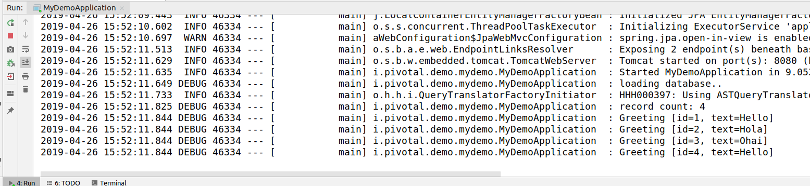

# Build a Spring Boot Application with JPA

In this exercise you'll build a basic Spring Boot application that uses JPA to access a database. When run locally (un-attached to any DB) it will use an in memory instance of H2, but if a datasource is present (eg: by adding it to the properties) it'll use it.  When pushed to Cloud Foundry and bound with a MySQL or Postgres service it will auto-magically use it instead.

You'll start with a shell project from start.spring.io, create a Domain, add an Interface which will tell Spring Data to create a Repository, and then add a bit of code to initialize it with some data.  After that you'll be able to start it as a Web application and browse the data via a ReSTful API.  With that done, you'll enhance the service.  Finally, you can try pushing it to Cloud Fundry and binding it to a sql database instance.

## 1 Create a new project using the Spring Initializer

1. If it's not running already launch a browser and navigate to http://start.spring.io
2. Enter a unique group and artifact id.


3. Expand More Options to see other things you can set.
4. Add the following features to the application: **Web**, **JPA**, **Rest Repositories**, **H2**, **MySQL**, and **Actuator**.  Start typing the name of the dependency and select it when it comes up on the list.


5. Generate the project 
6. Extract the zip into a directory
7. Open the project.  On Pivotal demo laptops there is both STS as well as IntelliJ.

If you're not familiar with Spring Boot apps spend a little time exploring the project.  There's a "main" class that tells Spring to start up and initialize everything, an applications.properties that's a default location for key/value pairs, and the POM is setup with dependancies that will tell Spring Boot to do things for us.  For example, adding the Web starter tells Boot to embed a Tomcat server in our app and setup its context so it just works.

## 2 Add Domain Object

First create a basic class to model a domain.  This will be nothing more then a string with an id.

1. Open the file with the primary applicaiton class.  eg: MyDemoApplication.java
2. Add a new class with the following code:

```java
// imports for JPA (put them at the top)
import javax.persistence.Entity;
import javax.persistence.GeneratedValue;
import javax.persistence.GenerationType;
import javax.persistence.Id;

@Entity
class Greeting {

  @Id
  @GeneratedValue(strategy = GenerationType.AUTO)
  private Integer id;
  private String text;

  public Greeting(String text) {
    super();
    this.text = text;
  }

  @Override
  public String toString() {
    return "Greeting [id=" + id + ", text=" + text + "]";
  }

  public Integer getId() {
    return id;
  }

  public String getText() {
    return text;
  }

  public Greeting() {}
}
```

## 3 Add Repository

Next, create an Interface that will tell Spring Data that you want to setup a Repository to manage our new Domain class.  The empty repository definition will create it with only basic operations.

1. Create a new file to define a public interface.  eg: Right click on the package under src/main/java and select New -> Interface
2. Enter GreetingRepository for the name, and click Finish
3. In the new interface add the following code:

```java
// import for Spring Data
import org.springframework.data.jpa.repository.JpaRepository;

public interface GreetingRepository extends JpaRepository<Greeting, Integer> {
}
```
Yes, it really is this easy to define a Repository!  The presence of this interface will result in Spring Data creating a repository in the context that can then be accessed by the app.

## 4 Setup the DB with Initial Data

In this step you will generate a Bean of type ApplicationRunner.  Instances of this class are run by Spring Boot when it starts up.  We'll use Spring's dependancy injection to pass in our Spring Data created Repository, and then populate it with some data.

1. Go back to the main application class file (eg: MyDemoApplication.java)
2. Add the following code:

```java
// imports for the Application runner
import org.slf4j.Logger;
import org.slf4j.LoggerFactory;
import org.springframework.boot.ApplicationRunner;
import org.springframework.context.annotation.Bean;

// public class MyDemoApplication {

    Logger logger = LoggerFactory.getLogger(MyDemoApplication.class);

    // Loads the database on startup using the repository created by Spring Data.
    @Bean
    ApplicationRunner loadDatabase(GreetingRepository gr) {
        return appRunner -> {
            logger.debug("loading database..");
            gr.save(new Greeting("Hello"));
            gr.save(new Greeting("Hola"));
            gr.save(new Greeting("Ohai"));
            logger.debug("record count: {}", gr.count());
            gr.findAll().forEach(x -> logger.debug(x.toString()));
        };
    }
    ...
```

## 5 Set Default Properties

1. Rename the file src/main/resources/application.properties to application.yml (select the file, and use the menu Refactor -> Rename...)
2. Add the following properties

```properties
logging:
  level:
    io:
      pivotal: DEBUG
spring:
  jpa:
    hibernate:
      ddl-auto: create-drop
```

Spring Boot uses a convention where it loads applications.yml (or .properties) by default.  The first property sets the logging level for everything under the package io.pivotal to DEBUG.  If you named you package something different change the properties to reflect the proper name.  This will allow you to see your logging messages in the Configuration class.

The second property is a Hibernate specific setting.  This will create a schema in the DB to support our applicaiton (destroying any existing version), and when the app closes the Session the schema will be deleted.  This is good for demos where you want to keep your DB clean.  (See the hibernate documentation on more options for this setting.)

## 6 Browse the Data

With all that done, launch the app and browse the data!

1. Run MyDemoApplication either by the using a run command or using the Boot Dashboard.  Notice the entries being added by the ApplicationRunner.



2. Switch to or launch a browser and go to the URL: http://localhost:8080/greetings


### 6.1 Check out the Actuator

Spring Boot brought us Actuator which generates a set of endpoints that provides information about what's happening in your application.  Boot 2 has added extra security to the actuator so enable env and beans in the property file.

1.  Open application.yml and add the following properties

```
management:
  endpoints:
    web:
      exposure:
        include: health,info,env,beans
```
2. Restart the application

Take a minute and look at all the good things you have access to view.  Note: the default URL has changed back to the original style and security is off by default.

http://localhost:8080/actuator/env

http://localhost:8080/actuator/beans


## 7 Add a Search Method

Now add a method to the Repository to do some searching.

1.  Go to the GreetingRepository file and add the following imports/method:

```java
import java.util.List;
import org.springframework.data.repository.query.Param;

//In the Interface
  List<Greeting> findByText(@Param("text") String text);  
```

2. Go to the ApplicationRunner and add the following to the part where you create records:

```java
      gr.save(new Greeting("Hello"));
```

This will add a new record with the same value so we can search and find 2 entries.

3. Restart the application and browse to the URL: http://localhost:8080/greetings/search

Notice the format that it gives you to search.  You can now find the two records you entered that have the value Hello with a URL like this:

http://localhost:8080/greetings/search/findByText?text=Hello

## 8 Push to Cloud Foundry

In this step you will build the application into a self-executing jar file and deploy it onto the Pivotal WebServices instance of Cloud Foundry using the command line tool ```cf```.  The tool is already installed on the demo machine, and logged in to an account.  For more information on all this, check out the demo and talk with the technical team at the PCF stations.

1. Go to the terminal, and navigate to your application.
2. Build the application with maven.
3. Push the applicaiton to Cloud Foundry

```bash
$ cd ~/S1P2017/workspace/<your_project>
$ ./mvnw clean package
(lots of output from build)
$ cf push your_app_name -p target/your_app_name-0.0.1-SNAPSHOT.jar --random-route
(lots of output from the push)
```

The --random-route flag tells Cloud Fundry to add random words to the URL for your app so that it won't conflict with any other applications that might use the same name you did.

<!---
## Add a Fancy UI

This is an optional step if you want to explore what a JavaScript consumer would look like.

If you're interested click the link: [Add UI](AddUI.md)
--->

## Cleanup

So the environment is ready for the next person, it would be helpful if you deleted files.  This keeps the project explorer clean, and if the someone happens to use the same name as you did there won't be any conflicts.

Thanks!

1. Delete the app from Cloud Foundry

```bash
$ cf delete your_app_name
Really delete the app your_app_name?> y
```

2. Right click on your project and select delete.  Click yes to delete the files.

# We hope you enjoyed the demo! :-)
